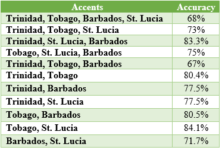

# DEEP Neural Networks For Caribbean Based Accent Classification
This repo contains the code,csv files for each experimental sets as well as a link to the data collection tool we created. The code include the files we used to preprocess our dataset,the CNN model we created from the accents as well as the code to train the neural network.The goal of this project was to create a accent classifer that is able to classify different Caribbean accents correctly. We used a 2D-CNN as our neural network and we had to collect data from various Caribbean countries ourselves since there were not many available resources we could use on recordings of Caribbean Accents.
The Caribbean countries/islands we used were Trinidad, Tobago, St. Lucia and Barbados. We used these countries as we were able to collect the most recordings them.

## Table of Contents
1. [Data Collection tool](#datacollection)
2. [Dataset](#dataset)
3. [Code Explanation](#code)
    * [Training](#training)
    * [Preprocessing](#preprocessing)
4. [Results](#results)


## Data Collection tool
The code for our data collection system is available at https://github.com/Kerschel/Dataset-Speech-Collector
This code is hosted on a Digital Ocean cloud server and can be accessed at https://myaccent.app

The code in the [prediction](https://github.com/Kerschel/Accent-CAC/tree/prediction) branch is also used as an API endpoint to perform accent predictions inside the myaccent.app application which currently is not hosted but can be used locally by running the [flask server file](https://github.com/Kerschel/Accent-CAC/blob/prediction/prediction.py).

## Dataset
The files for dataset can be accessed at [Experimental Datasets](https://myuwi-my.sharepoint.com/:f:/g/personal/kerschel_james_my_uwi_edu/Ehq1AkMiCSxJqeOIXPIklsIBHs9uZrAkrXv3KkOoOMCQvA?e=lKdsa5). 

## CSV File Format
Each csv file is used to link the accent (HomeCountry) to a corresponding filename. We also added the duration of the file to be able to filter out the files that were not useful to us i.e persons who submitted very short recordings by error.
This filtering was done in [trainmodel.py](training/trainmodel.py) on line 154-161.

## Code Explanation
### Training
Before running the code, all dependencies must be installed first from [requirements.txt](training/requirements.txt). Also ensure that you have python installed to perform the following commands:

```bash
pip install -r requirements.txt
```

To run the project use :
python trainmodel.py "experimental set csvfile" "modelname" "csvfilename for accuracy results"

* For Example:
```bash
python trainmodel.py ES1.csv test_model output.csv
```
Depending on which experimental set you wish to use the directory name needs to be changed in [helpers.py](training/helpers.py) on line 42 to reflect the folder (ES1,ES2,ES3).<br>
The csv file to check the validation and accuracy loss will be in the folder after running the code.

[trainmodel.py](training/trainmodel.py) - this is the main file that bring all the functions together to perform the classification.<br>
[helpers.py](training/helpers.py) - contains functions used for the MFCC processing as well as direction of which audio files are to be used in librosa.<br> 
[accuracy.py](training/accuracy.py) - used for the prediction classification to detemine how accuracy the predictions were and to create a confusion matrix to display the results<br>
[getsplit.py](training/getsplit.py) - used to add or remove how many accents will be used in the classifier also to increase or decrease the training and test size.<br>

### Preprocessing files
[duration.py](preprocessing/duration.py) - used to find the length of the audio files and save in a csvfile <br> <br>
Used for ES2 alone <br> 
[ratereduce.py](preprocessing/ratereduce.py) was used make the audio file slower in order to extract the silence-noise-silence periods from the wave in with [extractwords.py](preprocessing/extractwords.py)  
[originalrate.py](preprocessing/originalrate.py) - return the audio files to their original rate from what was lowerered previously<br> <br>
Used for ES2 and ES3 <br> 
[padding.py](preprocessing/padding.py) - used for ES2 and ES3 to add silence to the end of the audio files to make them a uniform length<br> 

## Results
After training our CNN we were able to acheive best average accuracies as follows on each experimental set:

ES1 - 38.9% on 4 accents<br>
ES2 - 41.25% on 4 accents<br>
ES3 - 68% on 4 accents, 83.3% on 3 accents and 84.1% on 2 accents

The breakdown of ES3 accuracies are as follows:<br>

